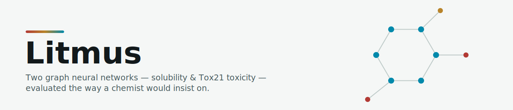
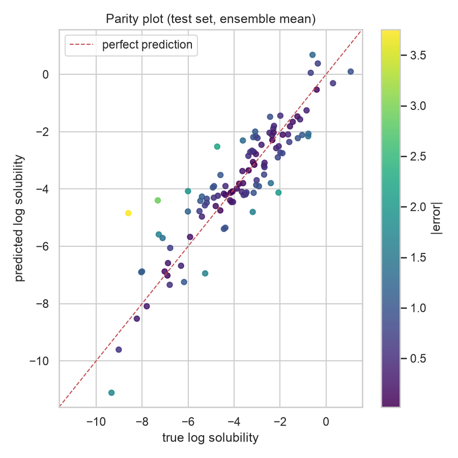
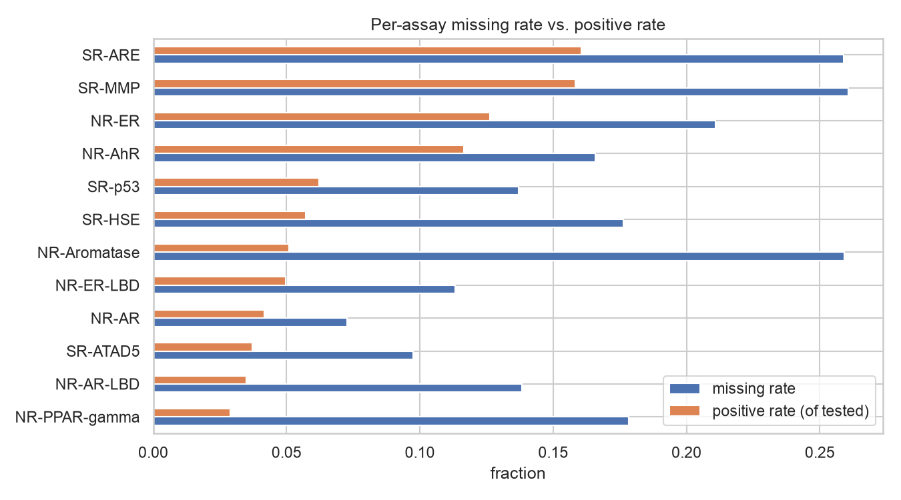
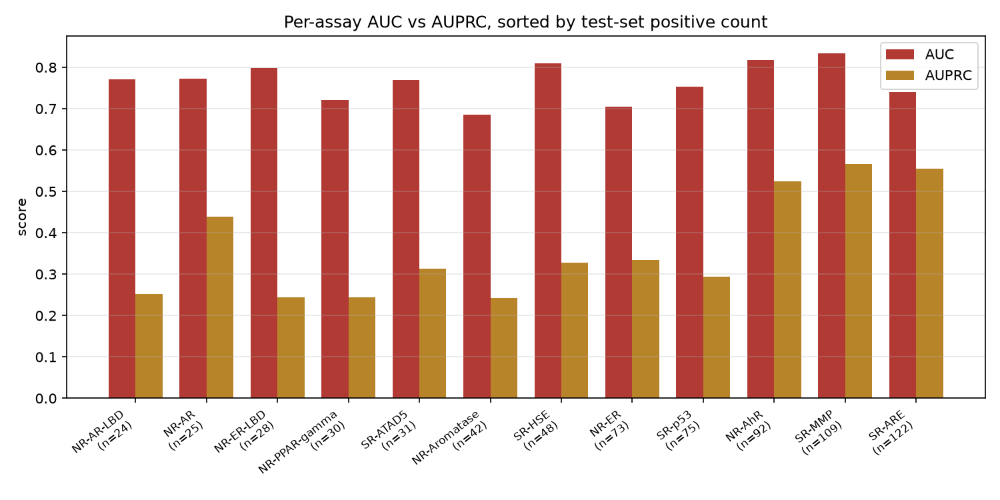
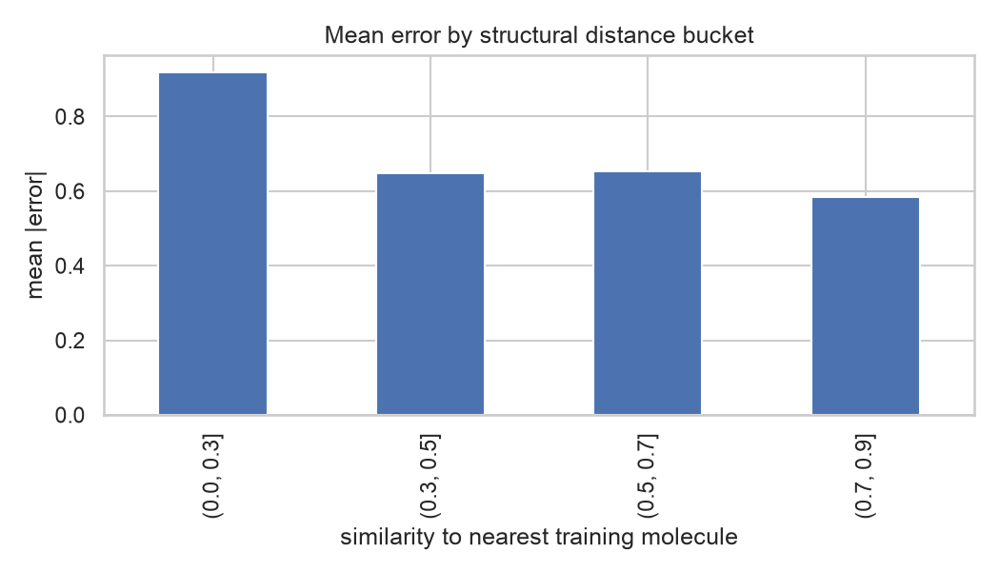

<p align="center">
  
</p>

<p align="center">
  <a href="https://litmus-prop.streamlit.app"></a>
  
  
  
</p>

<h3 align="center">🔗 <a href="https://litmus-prop.streamlit.app">Try the live demo →</a></h3>

Two graph neural networks — solubility and Tox21 toxicity — evaluated the way a chemist would insist on, and honest about where they break.

| Solubility (ESOL) | Toxicity (Tox21) |
|---|---|
| **R² 0.808** · RMSE 0.935 · scaffold-split test, n=111 | **Mean AUC 0.765** · mean AUPRC 0.361 · 12 assays, n=781 |



---

## Contents

- [What it does](#what-it-does)
- [Why the evaluation is trustworthy](#why-the-evaluation-is-trustworthy)
- [Results](#results)
- [Model & method](#model--method)
- [Limitations / domain of applicability](#limitations--domain-of-applicability)
- [Run it](#run-it)
- [What I'd do next](#what-id-do-next)
- [Project layout](#project-layout)

---

## What it does

Give Litmus a SMILES string — the text encoding of a molecule's structure — and it predicts two things a chemist would otherwise have to measure: how soluble the compound is in water, and whether it's likely to trip any of 12 standard Tox21 toxicity screens. Two properties today, both read directly off the molecular graph rather than off a table of precomputed descriptors.

```
SMILES → molecular graph (atoms + bonds) → 3× GINE layers → mean pool → head → prediction
```

Same backbone for both properties — the only difference is the last layer: **1 regression output** for solubility, **12 classification logits** (one shared trunk, one head per Tox21 assay) for toxicity.

Every prediction ships with a reason to trust it or not: for solubility, ensemble disagreement plus how structurally close the molecule is to anything the model has actually seen; for toxicity, a per-assay reliability tier computed from how much test data that assay actually had, since a rare assay's AUC is a much noisier number than a common one's.

For context, not competition: a 5-descriptor linear baseline (molecular weight, LogP, H-bond donors/acceptors, TPSA) scores R²=0.74 for solubility — but on an easier random split. LogP alone correlates −0.83 with solubility here, so a descriptor baseline is a real comparison, not a strawman; the graph network's job is to do better on the harder, scaffold-split task below.

---

## Why the evaluation is trustworthy

**Scaffold split, both properties.** Test molecules share no Bemis-Murcko core ring system with anything in training — not just no exact duplicate. ESOL's top 10 scaffolds cover 64% of its 1,128 molecules; Tox21's top 10 cover 48% of 7,823. Both are concentrated enough that a random split would let the model memorize near-identical structures and report an inflated score. Every number in this README is measured on chemistry the model has never seen a relative of.

**Masked loss, not zero-filled.** Tox21 assays are sparsely tested — 7% to 26% of molecules are missing a label per assay (below). A common practice with the standard Tox21 CSV is to zero-fill those gaps before training, which quietly tells the model that every untested molecule is a confirmed negative. Litmus masks instead: an (molecule, assay) pair that was never run contributes nothing to the loss and nothing to the reported metric. It's a less flattering number. It's also the true one.



Every assay is both sparsely tested **and** imbalanced — the reason for masked BCE and for reporting AUPRC alongside AUC.

---

## Results

### Solubility (ESOL, 5-seed ensemble)

| RMSE | MAE | R² | Test n |
|---|---|---|---|
| 0.935 | 0.726 | 0.808 | 111 |

### Toxicity (Tox21, 12 assays, single seed)

**The finding:** AUC is nearly flat across assays (0.685–0.834) regardless of how many positive test examples that assay has — it correlates with test-set positive count at r=0.17. AUPRC is not: r=0.79. The three best-supported assays (SR-MMP, SR-ARE, NR-AhR — 92 to 122 test positives) score 0.52–0.57 AUPRC; four of the thinnest (NR-AR-LBD, NR-ER-LBD, NR-PPAR-gamma, SR-ATAD5 — 24 to 31 positives) score 0.24–0.31, despite **comparable or higher AUC**. Read AUC alone and every assay looks about equally trustworthy. It isn't.



| Assay | AUC | AUPRC | n_pos (test) | Reliability |
|---|---|---|---|---|
| NR-AR-LBD | 0.772 | 0.251 | 24 | Low |
| NR-AR | 0.773 | 0.439 | 25 | Low |
| NR-ER-LBD | 0.798 | 0.244 | 28 | Low |
| NR-PPAR-gamma | 0.721 | 0.243 | 30 | Low |
| SR-ATAD5 | 0.769 | 0.314 | 31 | Low |
| NR-Aromatase | 0.685 | 0.243 | 42 | Medium |
| SR-HSE | 0.809 | 0.327 | 48 | Medium |
| NR-ER | 0.704 | 0.334 | 73 | Medium |
| SR-p53 | 0.753 | 0.294 | 75 | Medium |
| NR-AhR | 0.817 | 0.524 | 92 | High |
| SR-MMP | 0.834 | 0.566 | 109 | High |
| SR-ARE | 0.741 | 0.555 | 122 | High |

Reliability is the Hanley–McNeil standard error of that assay's AUC, bucketed: **high** (SE<0.03), medium, **low** (SE≥0.05). NR-ER-LBD's AUC of 0.798 is built on 28 positives — SE≈0.05, a 95% CI of roughly [0.70, 0.90].

---

## Model & method

Both properties run through the same **GINE** (Graph Isomorphism Network with Edge features) message-passing backbone — 3 layers, mean pooling, ~170K parameters. GINE was chosen specifically because it consumes bond features (type, conjugation, ring membership) alongside atom features, which matter for both solubility and reactivity-driven toxicity mechanisms. Every SMILES, in training or typed live into the app, goes through the exact same featurizer (`src/data_pipeline/featurizer.py`), so there's no train/inference skew.

Solubility's head is a single regression output, trained with plain MSE and reported in real log-solubility units via a train-only-fit target scaler. Toxicity's head is 12 logits — one shared trunk feeding 12 independent classification outputs — trained with a masked, per-assay-weighted binary cross-entropy (`src/training/tox21_losses.py`) that zeroes the gradient for every untested (molecule, assay) pair before averaging.

Class imbalance (3%–16% positive rate per assay) is handled with a per-assay `pos_weight` computed from the training split only. Checkpoint selection for toxicity is on validation mean AUC rather than validation loss, since AUC is the reported metric — in one training run the two criteria picked different epochs, and selecting on AUC scored 0.0046 higher on held-out test than selecting on loss would have. Small, but free, and the more defensible default.

Solubility runs a 5-seed ensemble (mean combination beat every individual member and the median/weighted alternatives). Toxicity currently trains one seed — see [What I'd do next](#what-id-do-next).

---

## Limitations / domain of applicability

**Novel scaffolds degrade solubility accuracy sharply.** Mean absolute error is roughly flat from 0.3 Tanimoto similarity upward (0.65, 0.65, 0.59 across the 0.3–0.9 range) and jumps to 0.92 below it. Below 0.3 similarity to anything in training, treat the number as a rough estimate, not a measurement.



**Halogenated and polycyclic structures are the specific weak spot** — not molecule size. Error correlates more with ring count (r=0.23) than atom count (r=0.14). The worst individual misses include a 7-ring steroid-like structure (MW 414, under-predicted by 3+ log units) and several heavily chlorinated aromatics.

**Rare Tox21 assays are a genuine blind spot.** NR-ER-LBD, NR-AR-LBD, NR-PPAR-gamma, and SR-ATAD5 each have fewer than 32 positive examples in the test set. Their AUCs look fine in isolation (0.72–0.80); their AUPRCs (0.24–0.31) and wide confidence intervals say otherwise. This is a data problem, not a modeling one.

---

## Run it

Or just use the **[live demo](https://litmus-prop.streamlit.app)** — no setup required. To run locally:

```bash
# 1. Install dependencies
pip install -r requirements.txt

# 2. Launch the UI (uses the checkpoints already in models/)
streamlit run app.py

# 3. Rebuild the solubility dataset from raw
python -m src.scripts.esol_data_processing
python -m src.data_pipeline.build_scaffold_split
python -m src.data_pipeline.esol_build_dataset

# 4. Retrain the 5-seed solubility ensemble
python -m src.training.esol_train_ensemble

# 5. Retrain and re-evaluate toxicity
python -m src.training.tox21_train
python -m src.training.tox21_evaluate
```

Swap `esol_` for `tox21_` in step 3 to rebuild the toxicity dataset instead — the two pipelines are file-for-file parallel.

---

## What I'd do next

The ceiling here is data, not architecture.

- **Toxicity ensemble** — train the same 5-seed ensemble Tox21 gets on solubility, for the same disagreement-based uncertainty signal (currently one seed).
- **Calibration** — temperature-scale the Tox21 probabilities so 0.70 means 70%, not just "more likely than 0.30" as it does today.
- **Data** — more scaffold-diverse positives for the four low-AUPRC assays. This is the single highest-leverage fix, and no architecture change substitutes for it.
- **External validation** — a test set outside ESOL/Tox21 entirely, to check the scaffold-split honesty claim holds up on chemistry neither dataset chose.
- **Representation** — pretrained molecular embeddings for the rare-assay regime specifically, worth trying only after the data gap above, not instead of it.

---

## Project layout

- `src/scripts/` — raw data → clean CSV
- `src/data_pipeline/` — clean CSV → graphs, scaffold split, dataloaders
- `src/architectures/` — GNN model definitions
- `src/training/` — train/evaluate scripts
- `src/inference/` — single-SMILES prediction + applicability-domain checks used by the UI
- `notebooks/` — EDA and error analysis
- `app.py` — Streamlit UI

Files are prefixed `esol_`/`tox21_` by which pipeline they belong to; unprefixed files (`featurizer.py`, `scaffold_split.py`, `gnn.py`, `features.py`) are shared by both.
